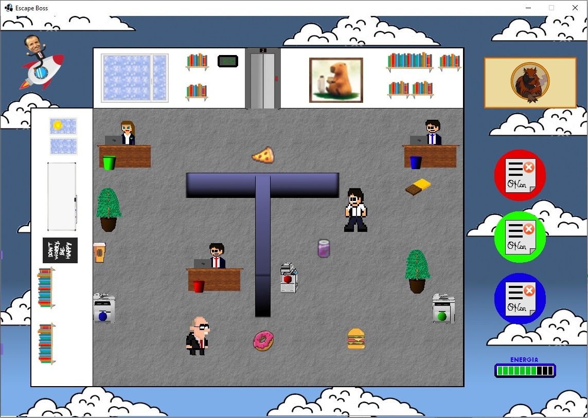
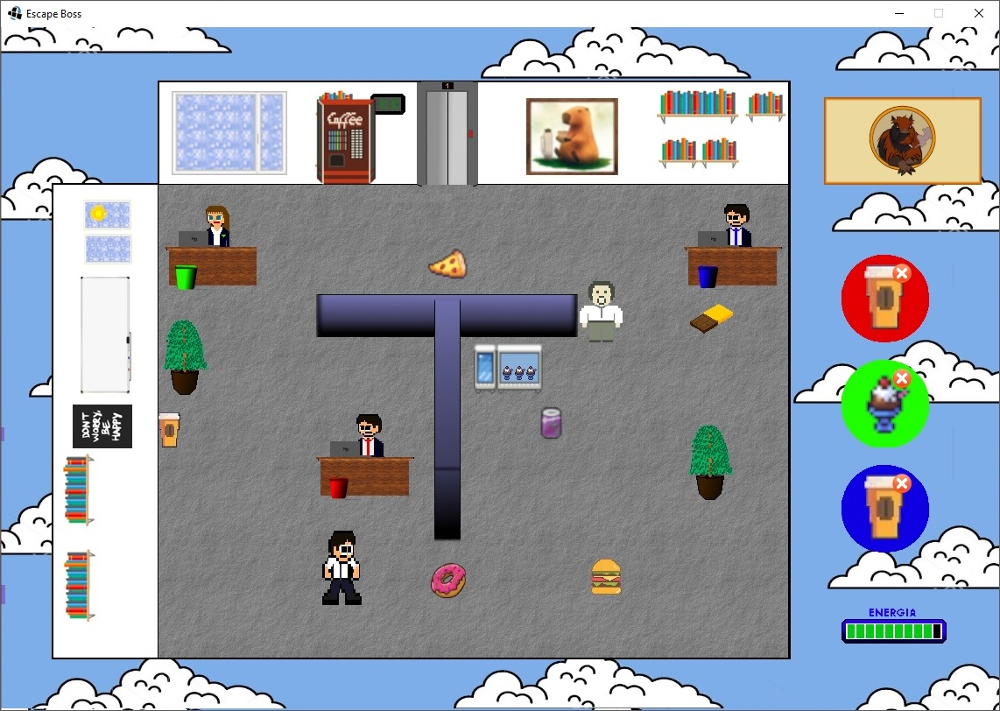
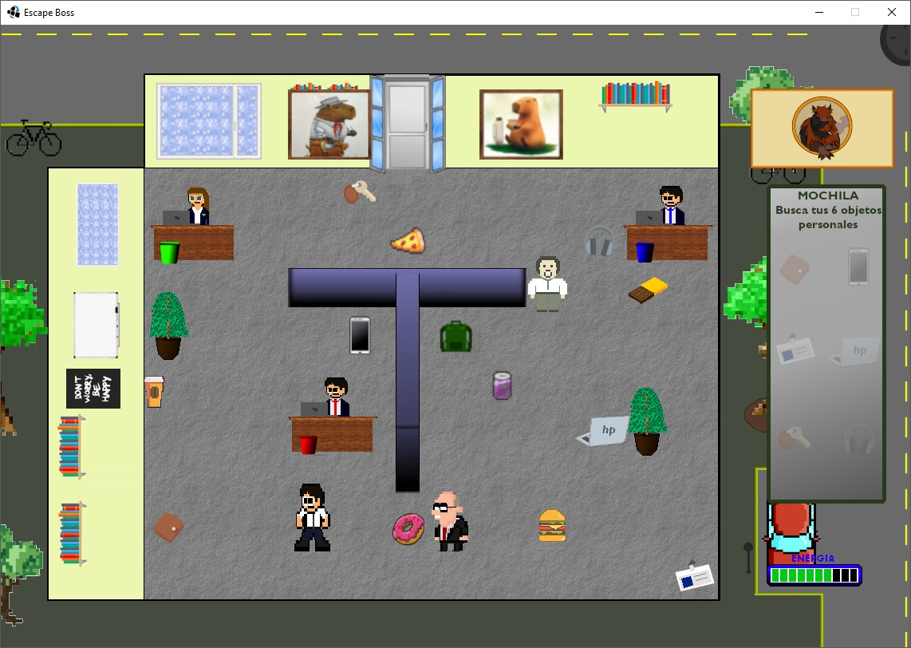

# ¡Bienvenidos a Escape Boss! 

 
# Introducción
Es un juego por niveles en el cual tendremos que cumplir determinadas tareas mientras escapamos de un Jefe y administramos nuestra energía mediante el consumo de alimentos, los cuales estan dentro del nivel. También está el agregado de las tarjetas, las cuales nos aportan ventajas como desventajas. Estas se activan cada 10 segundos.

# Dificultad

El juego tiene tres dificultades. Las cuales son Fácil, Mediano y Difícil. Esto hace variar la velocidad de persecución del Jefe.
Para confirmar una dificultad, se hace tocando alguna de las siguientes teclas:
- _Num1:_ Dificultad Fácil
- _Num2:_ Dificultad Media
- _Num3:_ Dificultad Difícil

# Instrucciones
Para mover al jugador utilizamos las teclas de dirección:
- _Tecla Arriba:_ El jugador se mueve hacia arriba.
- _Tecla Abajo:_ El jugador se mueve hacia abajo.
- _Tecla Izquierda:_ El jugador se mueve hacia la izquierda.
- _Tecla Derecha:_ El jugador se mueve hacia la derecha.

Para poder interactuar con los distintos objetos de cada nivel (impresoras, compañeros, consumibles, máquinas de pedidos, objetos y mochila) utilizamos la tecla de Interactuar.
- _Tecla E:_ El jugador interactúa con el objeto.

Las plantas nos sirven para escondernos del o los Jefe/s, los cuales, una vez que estemos escondidos, se dirigiran hacía la puerta. Esto nos sirve para salir de una situación peligrosa o para darnos más tiempo y recorrer el mapa por otro camino. Para esconderse sólo basta con posicionarse en la planta, y el jugador se esconde automáticamente.

Por último, para finalizar el nivel actual tendremos que dirigirnos hacia el ascensor o puerta. Con posicionarse en ese objeto, podremos avanzar al siguiente nivel o terminar el juego. Hay que recordar que para poder finalizar el nivel hay que cumplir la condición del mismo.

# Niveles
El juego está separado por 3 niveles.

__Primer nivel:__ 

El jugador tendrá que obtener las tareas desde las impresoras y entregarlas al compañero correspondiente del color. Por ejemplo, la tarea Verde hacia la Compañera Verde.
Una vez que estén las tres tareas completadas (lo describe en el interfaz de la derecha) se puede finalizar el nivel.

__Segundo nivel:__

El jugador tendrá que entregar los pedidos de sus compañeros. Estos pedidos se generan aleatoriamente, un compañero puede pedir un Helado como un Café. Una vez que estén los tres pedidos completados (lo describe en el interfaz de la derecha) se puede finalizar el nivel.

__Tercer nivel:__

El jugador tendrá que recoger sus objetos personales, pero antes de poder guardarlos necesitará obtener la mochila. Una vez que la haya recogido puede guardar los 6 (seis) objetos personales que están repartidos por todo el nivel. En éste nivel se agrega la dificultad que estarán los dos jefes de los niveles anteriores. Por último, para poder finalizar el nivel (y por consecuencia el juego) se necesitará que se hayan guardado todos los objetos personales (en el interfaz de la derecha describe el estado de la mochila).

# Desarrolladores
- Benvenaste, Nicolás
- Capomolla, Luciano Fabio
- Hoyos, Gonzalo Leonel
- Kaner Loy, Camila

Todos somos estudiantes de la UTN FRBA, de la materia Paradigmas de Programación.
Cursos: K2004 y K2104

# Origen del juego
Nuestro juego está basado en un juego de mesa de un solo jugador, llamado _Lunes_ desarrollado por __Super Noob Games__. El cual es un juego por turnos, donde hay que cumplir ciertas tareas mientras escapamos de un jefe, una vez cumplidas estas tareas podemos escapar y terminar el juego.
