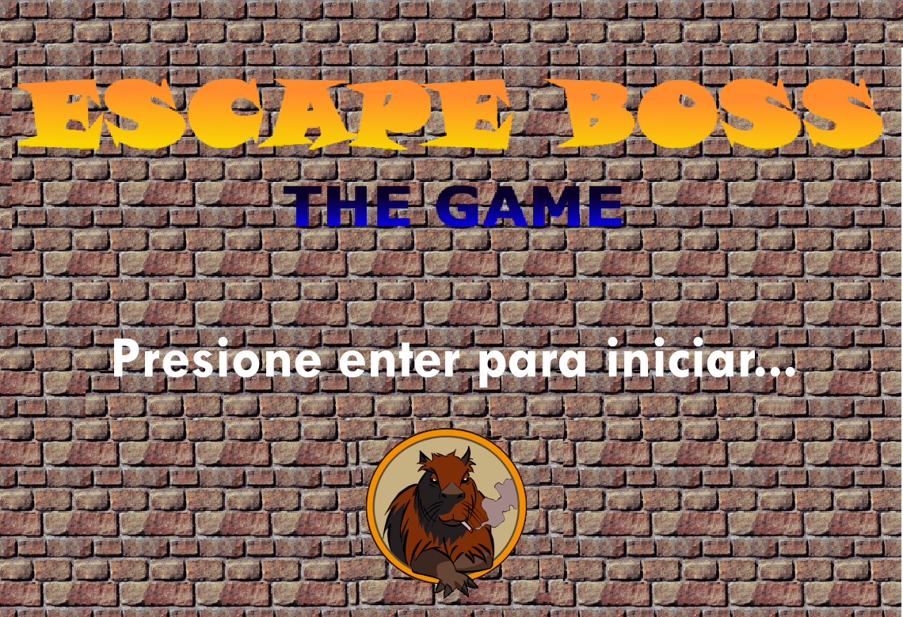
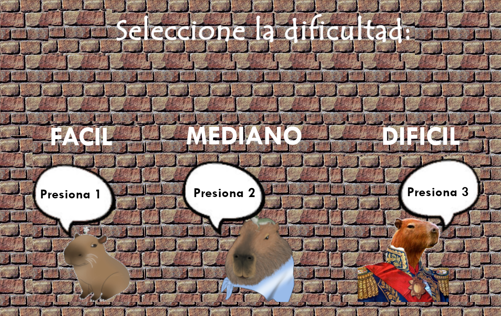

# ¡Bienvenidos a Escape Boss! 

 
# Introducción
Es un juego por niveles en el cual tendremos que cumplir determinadas tareas mientras escapamos de un Jefe y administramos nuestra energía mediante el consumo de alimentos, los cuales estan dentro del nivel.

# Dificultad

El juego tiene tres dificultades. Las cuales son Fácil, Mediano y Difícil. Esto hace variar la velocidad de persecución del Jefe.
Para confirmar una dificultad, se hace tocando alguna de las siguientes teclas:
Num1: Dificultad Fácil
Num2: Dificultad Media
Num3: Dificultad Difícil
